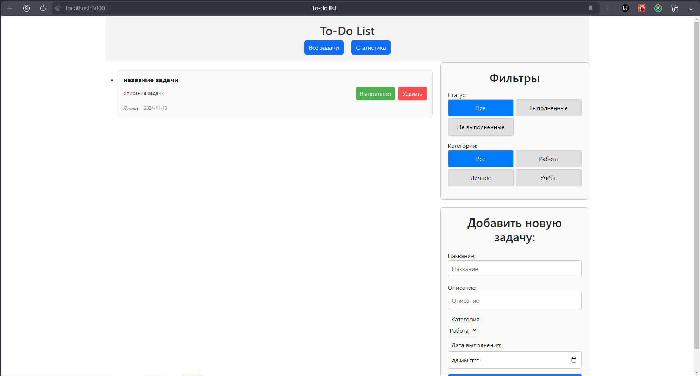

# To-Do List App

Это приложение для управления задачами, созданное с использованием React и Redux. Позволяет добавлять, редактировать, фильтровать и удалять задачи.

## Скриншоты



## Используемые технологии

- React
- Redux
- TypeScript
- CSS (SCSS)

## Функционал

- Добавление и удаление задач
- Фильтрация задач по категориям
- Сохранение состояния в локальном хранилище

## Установка и запуск

1. Клонируйте репозиторий
   ```bash
   git clone https://github.com/username/project-name.git
   ```
2. Перейдите в папку проекта
   ```bash
   cd project-name
   ```
3. Установите зависимости
   ```bash
   npm install
   ```
4. Запустите проект
   ```bash
   npm start
   ```

## Планы по улучшению

- Добавить анимацию
- Добавить авторизацию пользователей
- Подключить базу данных для хранения задач

## Автор

Александр Рудаков - [aleksandrrdk.code@gmail.com](mailto:aleksandrrdk.code@gmail.com)
